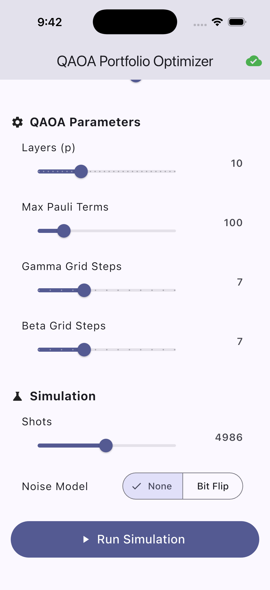
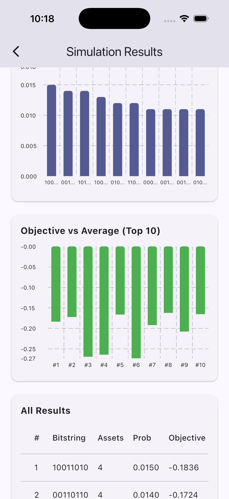

# LIB Dependency YQuantum Project
Within 24 hours we designed this quantum solution using QAOA Hamiltonian Simulation with Pauli Propagation and implemented it into a Flutter mobile app.
- qaoa_pauli_prop.py: Our quantum computing code
- YQuantum2026_Portfolio_Optimization.pdf: An explanation of our math
- Mobile folder: Flutter application

<table>
  <tr>
    <td></td>
    <td></td>
  </tr>
</table>

# Prompt: 

## Optimization of Premium Investment Portfolios

Use case by The Hartford and Capgemini’s Quantum Lab supported by QuEra 

## Description of broad problem

Insurance companies collect large volumes of premiums that must be invested to ensure long term financial stability and the capacity to pay future claims. Unlike traditional asset managers, insurers operate under stringent solvency and liquidity requirements, meaning they must pursue stable returns while simultaneously protecting capital and managing risk exposures.

An insurer’s investment portfolio may include government bonds, investment grade and high yield credit, equities, infrastructure, real estate, and cash instruments. Each asset class demonstrates unique patterns of expected return, volatility, liquidity, and regulatory capital charges. Furthermore, these assets often exhibit varying degrees of correlation due to global interest rate changes, credit market conditions, macroeconomic events, or broad market fluctuations. During periods of financial stress, several asset classes may fall in value at the same time, which can jeopardize diversification benefits and impact solvency.

Constructing a portfolio that balances expected return with risk, while adhering to these constraints, is therefore a highly non trivial task. A typical investment portfolio must:

- generate attractive long term returns,
- remain resilient to correlated market shocks,
- meet capital and solvency requirements,
- maintain sufficient liquidity,
- and avoid excessive concentration in any single asset class or market exposure.

This challenge invites participants to explore methods for identifying such optimized portfolios. Modern techniques such as Markowitz mean variance optimization serve as a classical foundation, but real world constraints and complex asset interdependencies create an opportunity to explore how quantum computing approaches might enhance portfolio construction.

## Where quantum can be used

### Mathematical formulation of the problem

A common and well established approach for constructing investment portfolios is the Markowitz mean–variance optimization framework. This method focuses on identifying a portfolio that maximizes expected return while minimizing overall risk, where risk is quantified through the covariance structure of asset returns. 

For insurance companies, this process is particularly important because investment decisions must balance profitability with regulatory constraints and capital preservation. The classic Markowitz objective function can be expressed as:

- q>0 represents the insurer’s risk aversion. Higher values place greater emphasis on risk reduction relative to return.
- w_i is the portfolio weight assigned to asset i. 
- σ_ij denotes the covariance between the returns of assets iand j, capturing how their risks move together.
- μ_i is the expected return of asset i.

The goal is to find the values of w_i that minimize the total portfolio risk, taking into account the correlations σ_ij between all pairs of properties. This optimization ensures that the selected portfolio has the lowest possible risk due to uncorrelated properties.

### Quantum approaches

The formulation above is not ready for a quantum computer yet, because it has constraints. We can add the term λ(∑_i*w_i -B)^2 to make sure the objective function is minimal when the constraint ∑_i*w_i =B is met. λ is a penalty term that you have to tweak in order to make the solutions feasible, but also non-trivial.
The final formulation is

Now the formulation is called a quadratic unconstrained binary optimization or QUBO problem. Quadratic because of the term w_i w_j, unconstrained because there are no constraints, and binary because the w_i’s are binary variables. This formulation is a good fit for quantum computers, as it is reminiscent of the Ising model.
Techniques such as the Quantum Approximate Optimization Algorithm (QAOA) [1], [2], variational eigen solvers (VQE) [3], [4], or analog approaches [5] may be used to explore large combinatorial landscapes and identify low energy configurations that correspond to promising portfolios.

In this challenge, we encourage you to explore how the structure of the portfolio problem interacts with quantum hardware considerations. Investment portfolios frequently lead to densely connected problem graphs, and you may reflect on how different hardware connectivity models influence the implementation and performance of quantum optimization algorithms.
Expectations of the challenge

You are invited to develop an approach that at least:

- Formulates the investment portfolio as an optimization problem,
- Constructs a QUBO or Ising representation,
- Run a circuit on Bloqade with 8 Qubits

After you have a running circuit, it will be important to scale and add noise to resemble a real-life situation. There are different ways to realize that and we highly encourage you to challenge yourself here. 

- Investigates the influence of qubit connectivity and noise,
- Explores quantum-inspired or quantum-based optimization strategies,
- Demonstrates how different simulations or hardware assumptions affect outcomes 

The goal is not only to optimize a portfolio, but to understand the interplay between algorithmic choices and hardware features, problem structure and how qubit connectivity impacts scaling. You are free to pursue additional modeling choices or innovative approaches that they believe may strengthen your solution.

Additionally, you are asked to make the solution (demo) applicable and understandable to the stakeholders, so try to get their advice on the matter.

## Judging criteria

## Resources

### Starting points

Here are some webpages, video’s, articles that might get you started

- Optimizing QAOA in a noisy setting:
https://bloqade.quera.com/v0.32.0/digital/tutorials/auto_parallelism/#example-4-qaoa-graph-state-preparation 

- Scaling up simulations using Pauli Propagations:
https://github.com/MSRudolph/PauliPropagation.jl, https://github.com/Qiskit/pauli-prop 

-  Portfolio Optimization - Qiskit Finance 0.4.1:
https://qiskit-community.github.io/qiskit-finance/tutorials/01_portfolio_optimization.html

- Solving combinatorial optimization problems using QAOA:
https://github.com/Qiskit/textbook/blob/main/notebooks/ch-applications/qaoa.ipynb

### References

[1]	E. Farhi, J. Goldstone, and S. Gutmann, “A quantum approximate optimization algorithm,” arXiv preprint arXiv:1411.4028, 2014.

[2]	N. Sachdeva et al., “Quantum optimization using a 127-qubit gate-model IBM quantum computer can outperform quantum annealers for nontrivial binary optimization problems,” Jul. 22, 2024, arXiv: arXiv:2406.01743. Accessed: Sep. 13, 2024. [Online]. Available: http://arxiv.org/abs/2406.01743

[3]	M. Cerezo et al., “Variational quantum algorithms,” Nature Reviews Physics, vol. 3, no. 9, pp. 625–644, 2021.

[4]	D. Wang, O. Higgott, and S. Brierley, “Accelerated Variational Quantum Eigensolver,” Physical review letters, vol. 122, no. 14, p. 140504, 2019.

[6]	S. Stastny, H. P. Büchler, and N. Lang, “Functional completeness of planar Rydberg blockade structures,” Physical Review B, vol. 108, no. 8, p. 085138, 2023.

[7]	M. W. Johnson et al., “Quantum annealing with manufactured spins,” Nature, vol. 473, no. 7346, pp. 194–198, 2011.

[8]	C. C. McGeoch, K. Chern, P. Farré, and A. K. King, “A comment on comparing optimization on D-Wave and IBM quantum processors,” Jun. 27, 2024, arXiv: arXiv:2406.19351. Accessed: Oct. 17, 2024. [Online]. Available: http://arxiv.org/abs/2406.19351

